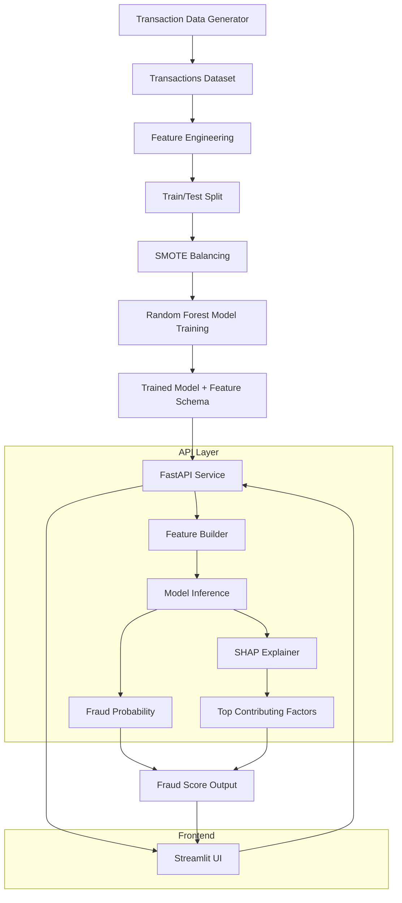

# M-PESA-Transaction-Anomaly-Scorer
Build a fraud detection model on synthetic M-PESA transaction data. 

```mermaid
flowchart TD
    A[Transaction Data Generator] --> B[Transactions Dataset]
    B --> C[Feature Engineering]
    C --> D[Train/Test Split]
    D --> E[SMOTE Balancing]
    E --> F[Random Forest Model Training]
    F --> G[Trained Model + Feature Schema]
    G --> H[FastAPI Service]

    subgraph API Layer
        H --> I[Feature Builder]
        I --> J[Model Inference]
        J --> K[Fraud Probability]
        J --> L[SHAP Explainer]
        L --> M[Top Contributing Factors]
    end

    subgraph Frontend
        N[Streamlit UI] --> H
        H --> N
    end

    K --> O[Fraud Score Output]
    M --> O
    O --> N
```
